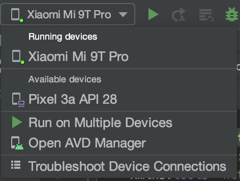
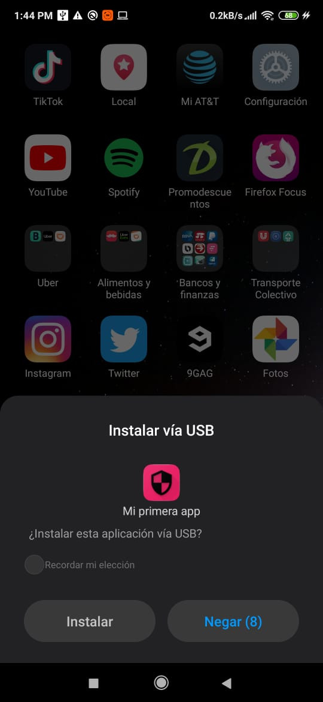
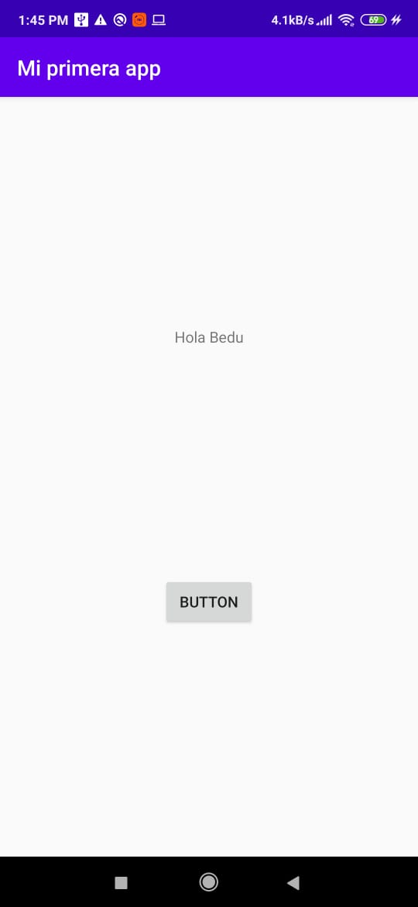

[`Kotlin Intermedio`](../../Readme.md) > [`Sesión 01`](../Readme.md) > `Ejemplo 4`

## Ejemplo 3: Emulación de dispositivos

### 1. Objetivos :dart:

- Correr una aplicación en un dispositivo físico

### 2. Requisitos :clipboard:

1. Android Studio Instalado en nuestra computadora.
2. Smartphone Android físico

### 3. Desarrollo :computer:

Para poder instalar aplicaciones de debugging desde Android Studio, es necesario activar las __opciones de desarrollador__ y activar la __depuración USB__, para ello, seguiremos los pasos siguientes:

1. En tu teléfono, abre la app de configuración.

2. Si tu dispositivo usa Android 8.0 o una versión posterior, selecciona Sistema. De lo contrario, continúa con el paso siguiente.

3. Ve hasta abajo del menú y pulsa en ___Acerca del teléfono___.

4. Nuevamente desplázate hasta la parte inferior, localiza la opción ___Número de compilación___ y presiona 7 veces. Con esto, habrás habilita las ___Opciones para desarrolladores___.

5. Regresa al menú anterior, en la parte inferior localizarás las ___Opciones para desarrolladores___, presiona sobre él.

6. Finalmente, activa la opción que diga ___Depuración de USB___.

Estos pasos están sujetos a la capa de personalización de Android que utilicemos. Si tu teléfono es marca Huawei o Samsung, quizá tengan un método diferente de activar la __Depuración de USB___. Consulta en el sitio web del fabricante o en google para más información.

Ahora que tenemos el modo de depuración activo, procedemos a correr la aplicación en el dispositivo.

Conectamos el teléfono a nuestro dispositivo y en Android Studio, en el selector de dispositivos, veremos que nuestro teléfono ha sido reconocido por la IDE.

Podemos abrir la lista de dispositivos para seleccionar nuestro dispositivo virtual si así lo quisiéramos.

Damos al botón play para reproducir nuestra app en el dispositivo, esperamos un momento.

Algunos teléfonos piden autorización para la instalación segura, como este Xiaomi, si esto sucede acepta la instalación.

Listo! tenemos ahora nuestra aplicación corriendo en el dispositivo!

[`Anterior`](../Readme.md#estructura-del-proyecto) | [`Siguiente`](../Readme.md#)

