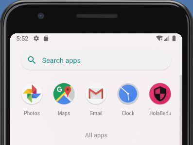
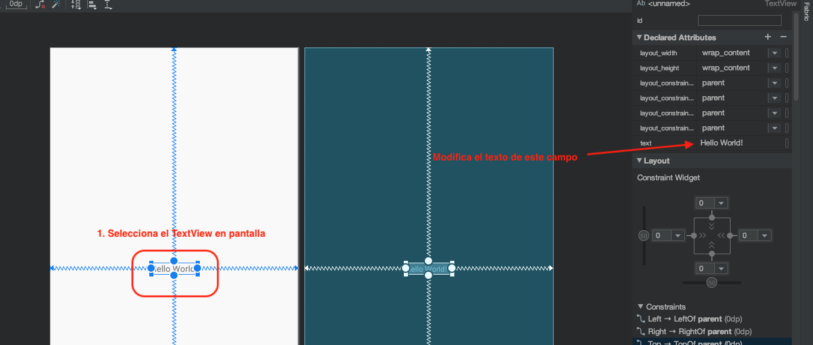

[`Kotlin Intermedio`](../../Readme.md) > [`Sesión 01`](../Readme.md) > `Reto 1`
	
## Reto 1: 

### 1. Objetivos :dart:

- Cambiar el ícono por defecto
- Modificar el layout por default
- Agregar un texto programáticamente 

### 2. Requisitos :clipboard:

1. Android Studio instalado
2. Al menos un Emulador android configurado

### 3. Desarrollo :computer:

1. Sustituir los icon launcher en los directorios _mipmap_ por íconos personalizados. Puedes acceder a los archivos zip con los íconos para reemplazar o crear los propios desde [esta página](https://romannurik.github.io/AndroidAssetStudio/icons-launcher.html#foreground.type=clipart&foreground.clipart=android&foreground.space.trim=1&foreground.space.pad=0.25&foreColor=rgba(96%2C%20125%2C%20139%2C%200)&backColor=rgb(68%2C%20138%2C%20255)&crop=0&backgroundShape=square&effects=none&name=ic_launcher).

* Los íconos los encuentras en [Este archivo](ic_launcher.zip)
* La versión redondeada de los ínconos están en [Este archivo](ic_launcher_round.zip)

Hint: Elimina la carpeta ___mipmap-anydpi-26___.

Solución

Visualizar el proyecto en modo Project.
	

Reemplazar en cada directorio mipmap tanto los archivos ic_launcher como ic_launcher_round

Eliminar la carpeta mipmap-anydpi-26

Correr nuevamente el proyecto.

El resultado: ícono renovado

 

2. Entrar a _res/values/strings.xml_ y modificar el texto entre los tags de string. Correr la app nuevamente y comentar el resultado.

Solución

Modificar el texto de la string app_name

El cambio sucede tanto en el título del launcher de la aplicación, como de la AppBar.

 

3. Abre el archivo **activity_main.xml** dentro de *res/layouts* y selecciona el texto (TextView)  en el preview de la pantalla. Checa la columna  _Attributes_ y modifica el campo _text_.

4. Arrastra a cualquier parte de la pantalla un elemento Button y corre el proyecto. Qué sucede?

Solución

El paso 3 modifica el Texto del TextView 

Mientras que el paso 4 (Arrastrar el botón) provoca que salga un botón en pantalla, pero este se alineará a la esquina superior izquierda (el por qué se aborda en otro tema).

 

[`Anterior`](../Ejemplo-02/Readme.md) | [`Siguiente`](../Readme.md#estructura-de-una-consulta)

