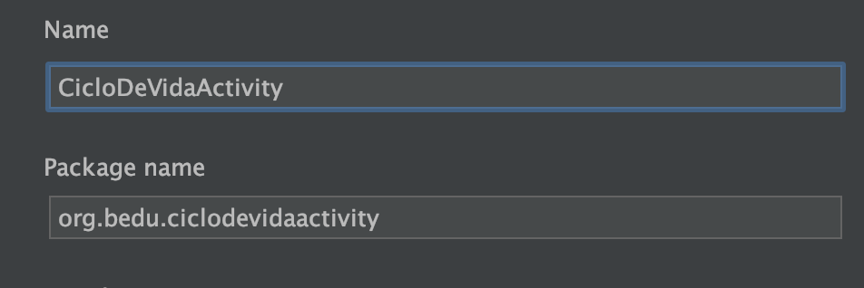

[`Kotlin Intermedio`](../../Readme.md) > [`Sesión 03`](../Readme.md) > `Ejemplo 4`

## Ejemplo 4: Ciclo de vida de un Activity

<div style="text-align: justify;">

### 1. Objetivos :dart:

- Volver visible el ciclo de vida de un activity a través de indicadores visual para corroborar el orden en el flujo estudiado previamente, para su posterior uso.

### 2. Requisitos :clipboard:

1. Android Studio Instalado en nuestra computadora.
2. Seguir la instrucción específica para esta sesión.

### 3. Desarrollo :computer:

Como estudiamos anteriormente, cada estado del ciclo de un Activity ejecuta ciertas tareas para correr/finalizar procesos, y se pueden sobreescribir para inicializar la lógica de negocio en la pantalla. En este ejercicio vamos a confirmar el orden en el flujo previamente estudiado. 

Nos apoyaremos de un elemento visual llamado **Toast**


Para realizar el ejemplo, seguimos los siguientes pasos:

1.- Crear un nuevo proyecto con una Activity vacía.


2.- Ingresar el siguiente nombre y package name para el proyecto



3.- Al crearse el proyeccto, abrir la ventana MainActivity, en ella encontraran esto:

```kotlin
override fun onCreate(savedInstanceState: Bundle?) {
        super.onCreate(savedInstanceState)
        setContentView(R.layout.activity_main)
    }
```
>no hay que olvidar que la sentencia *override* es un modificador que sirve para sobreescribir un método implementado por la clase que se hereda.

bajo esta función, hacer override de los otros métodos llamados durante el ciclo de vida de un Activity, e insertar en ellas el Toast con un texto que identifique en el estado del ciclo en que unon se encuentra.

```kotlin
override fun onStart() {
   super.onStart()
   Toast.makeText(this, "onStart", Toast.LENGTH_SHORT).show()
}

override fun onResume() {
   super.onResume()
   Toast.makeText(this, "onResume", Toast.LENGTH_SHORT).show()
}

override fun onPause() {
   Toast.makeText(this, "onPause", Toast.LENGTH_SHORT).show()
   super.onPause()
}

override fun onStop() {
   Toast.makeText(this, "onStop", Toast.LENGTH_SHORT).show()
   super.onStop()
}

override fun onRestart() {
   super.onRestart()
   Toast.makeText(this, "onRestart", Toast.LENGTH_SHORT).show()
}

override fun onDestroy() {
   Toast.makeText(this, "onDestroy", Toast.LENGTH_SHORT).show()
   super.onDestroy()
} 
```

4.- Después de esto, correr la aplicación en el emulador, y comprobar el flujo. Describir qué métodos se mandan a llamar cuando la aplicación se minimiza y cuando se cierra.


[`Anterior`](../Ejemplo-03/Readme.md) | [`Siguiente`](../Ejemplo-05/Readme.md)


</div>


