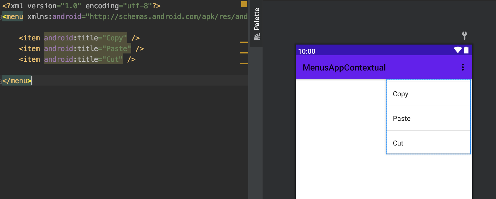

[`Kotlin Intermedio`](../../Readme.md) > [`Sesión 06`](../Readme.md) > `Ejemplo 1`


## Ejemplo 1: Tipos de Menu en Android

### 1. Objetivos :dart:

- Crear menus de opciones utilizando las clases dedicadas a esto incluidas en el SDK de Android.
- Entender los elementos que conforman a cada uno de estos tres tipos de menu.
- Aprender a definir y crear los tres tipos de menus en Android: Popup, Contextual y Opciones.

### 2. Requisitos :clipboard:

1. Android Studio 4.1
2. Kotlin 1.3
3. AVD Virtual device con API 11 (Android 3.0) o superior
4. Conexión a internet

### 3. Desarrollo :computer:

Los Menus de opciones en Android pertenecen a una interfaz llamada de la misma manera, [Menu](
https://developer.android.com/reference/kotlin/android/view/Menu?hl=es#).

> interface Menu

Esta interfaz es usada para definir dos tipos de menú, El ContextMenu y el SubMenu.

La manera mas simple de agregar un menú es "inflando" un archivo XML utilizando **MenuInflater**.

Y para recibir la acción de selección de alguna opción, nos basaremos en los métodos `onOptionsItemSelected(MenuItem)` y `onContextItemSelected(MenuItem)`.

Hay algunas funcionalidades que no son soportadas. Por ejemplo iconos en el caso de Context Menus y CheckMarks en el caso de Option Menus.


#### Definiendo un menú en XML

Para definir un menú, crearemos un archivo XML dentro del directorio del proyecto `res/menu/`.

El menú estará conformado por los siguientes elementos:

- `<menu>` define un **Menu**. Un elemento `<menu>` es el contenedor general y puede tener uno o más elementos `<item>`y `<group>`.


- `<item>` crea un **MenuItem**, que representa un único elemento en un menú. Este elemento puede contener un elemento `<menu>` anidado para crear un submenú.


- `<group>` **contenedor** opcional e **invisible** para elementos `<item>`. Te permite categorizar los elementos de menú para que compartan propiedades. Es solo una agrupación.


Ejemplo de menú en xml:

```
<?xml version="1.0" encoding="utf-8"?>
<menu xmlns:android="http://schemas.android.com/apk/res/android">
    <item android:id="@+id/new_game"
          android:icon="@drawable/ic_new_game"
          android:title="@string/new_game"
          android:showAsAction="ifRoom"/>
    <item android:id="@+id/help"
          android:icon="@drawable/ic_help"
          android:title="@string/help" />
</menu>
```

En este código, se observa una propiedad llamada `android:showAsAction="ifRoom"`. Esto indica que se mostrará el menú si hay espacio en pantalla. Para ver mas sobre esta opción ver la [documentación](https://developer.android.com/guide/topics/resources/menu-resource?hl=es).


#### Creamos un proyecto nuevo...

### OPTIONS MENU

Una vez creado un proyecto en Android, agregaremos un icono en nuestro folder `res` en `drawables`.  Para agregar un icono, damos click derecho y seleccionamos las siguientes opciones `New > Vector Asset`, elegimos un nombre.


Para crear los menus, crearemos un nuevo directorio. Click derecho sobre `res` y dando click derecho, elegimos `New > Directory`, escribimos **Menu**.

En la carpeta generada, damos click derecho y elegimos `New > Menu Resource File`, para agregar el elemento de Menu, escribimos un nombre y lo creamos.


En este archivo en XML escribiremos los elementos del Menu de Opciones.

```
<?xml version="1.0" encoding="utf-8"?>
<menu xmlns:android="http://schemas.android.com/apk/res/android"
    xmlns:app="http://schemas.android.com/apk/res-auto">
    <item android:id="@+id/item1"
        android:icon="@drawable/ic_search"
        android:title="Item1"
        app:showAsAction="ifRoom" />
</menu>
```


Agregamos otro elemento de menú.

**OJO** observamos que se agrega otro botón de buscar. Para corregir esto nos dirigimos a `showAsAtion` en el código XML, lo cambiamos a `never`.


Ahora, agregaremos un Submenu. Para lograr esto, escribimos dentro de Item un bloque de Menu con Items en el interior, estos Items serán las opciones del submenú.

```
    <item android:id="@+id/item3"
        android:icon="@drawable/ic_search"
        android:title="Item2"
        app:showAsAction="never">

        <menu>
            <item android:id="@+id/subitem1"
                android:title="SubItem1"
                app:showAsAction="never" />

            <item android:id="@+id/subitem2"
                android:title="SubItem2"
                app:showAsAction="never" />
        </menu>
    </item>
```


Ahora bien, nos dirigimos a la clase `MainActivity` y agregamos el código de menú que nos ayudará a mostrar la implementación en XML en pantalla.

```
class MainActivity : AppCompatActivity() {
    override fun onCreate(savedInstanceState: Bundle?) {
        super.onCreate(savedInstanceState)
        setContentView(R.layout.activity_main)
    }

    override fun onCreateOptionsMenu(menu: Menu?): Boolean {
        val inflater = menuInflater
        inflater.inflate(R.menu.options_menu, menu)
        return super.onCreateOptionsMenu(menu)
    }
}
```


### CONTEXTUAL MENU

Creamos un nuevo proyecto, en el cuál nos dirigimos al `activity_mail.xml`. Agregamos un Elemento de Layout como un TextView.

Creamos un directorio de Menu  y agregamos un Menu Resource File llamado `menu_context`. Este menú tendra las opciones de click derecho como Cortar, Copiar, Pegar, etc.



**Opcional**:
Nos dirigimos al `Gradle` (Module: app) para agregar la dependencia de Material Design. Sincronizamos.

> implementation 'com.android.support.design:28.0.0'


Una vez terminado de sincronziar el *Gradle*, vamos a **MainActivity** para implementar el **Context Menu**.

Agregamos el elemento que tendrá este menú. Se activará dando un Tap largo.
El elemento se debe registrar con la función `registerForContextMenu(txTextView)`.


```
override fun onCreateContextMenu( menu: ContextMenu?, v: View?, menuInfo: ContextMenu.ContextMenuInfo?) {
     super.onCreateContextMenu(menu, v, menuInfo)
     var inflater = menuInflater
     inflater.inflate(R.menu.menu_context, menu)
}
```


### POPUP MENU

Similar a los menús anteriores. Creamos un proyecto nuevo, nos dirigimos al `activity_main.xml` y agregamos un botón.

Este **botón** servirá para lanzar el PopUp Menu.

Creamos un Directorio de Menu y un Menu Item en XML con las opciones que necesitemos. 

Esta implementación sera similar al Context Menu.

Vamos al MainActivity, agregamos un Listener en la clase.

```
class MainActivity: AppCompatActivity(), View.OnClickListener {

	 //...

    override fun onClick(v: View?) {
        TODO("Not yet implemented")
    }
}
```

Dentro de este onClick, agregaremos una instancia de PopupMenu.

```

var popMenu = PopMenu(this, v)
popMenu.menuInflater.inflate(R.menu.popmenu, popMenu.menu)
popMenu.show()

```


#### Referencias: 

> https://developer.android.com/guide/topics/ui/menus?hl=es#xml


[`Anterior`](../Readme.md) | [`Siguiente`](../Reto-01/Readme.md)


</div>
