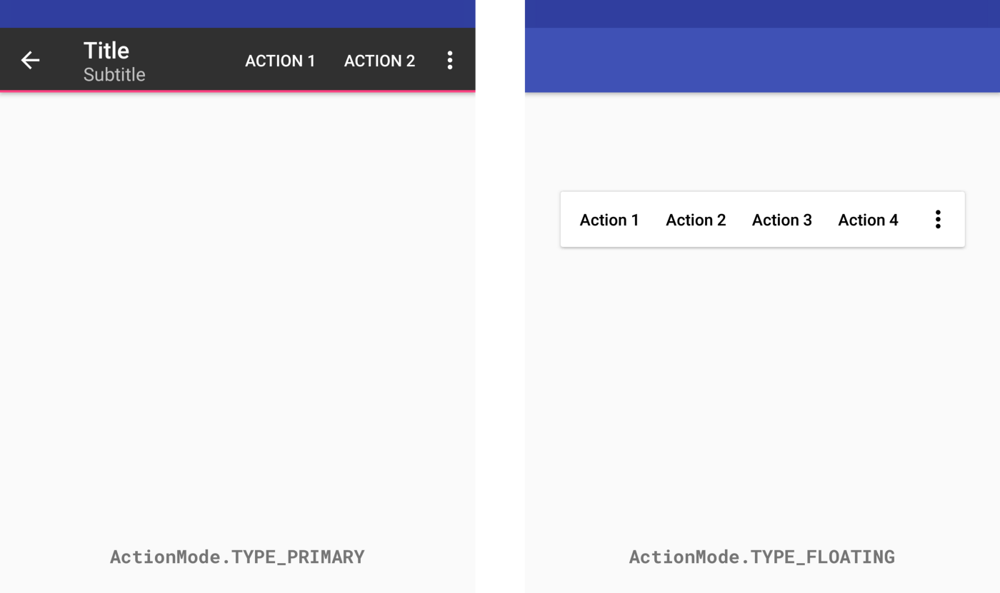

[`Kotlin Intermedio`](../../Readme.md) > [`Sesión 07`](../Readme.md) > `Ejemplo 3`


## Ejemplo 3: Action Modes

<div style="text-align: justify;">

### 1. Objetivos :dart:

- Aprender a implementar contextual menus reutilizables para Views y Activities.

### 2. Requisitos :clipboard:

1. Android Studio 4.1
2. Kotlin 1.3
3. AVD Virtual device con Android API 23 o superior

### 3. Desarrollo :computer:

## ActionMode

Recordando los menus contextuales, aquellos que se enfocan sobre elementos de UI que especifiquemos. Encontramos los ActionMode, estos son una implementacion similar al contextual menu, veamos.



Como se muestra en la imagen, tenemos dos tipos.
Primaria y Flotante.

En la Primaria los elementos se muestran en el action bar. En el caso de Flotating, el toolbar es mostrado sobre la vista de manera flotante. Es importante mencionar que solo se podra ocultar este menú de manera programada.

Esto nos da dos Properties:

	- ActionMode.TYPE_PRIMARY
	- ActionMode.TYPE_FLOATING

Los action mode pueden ser mostrados sobre cualquier View o Activity.

En cualquier caso hay dos funciones que debemos usar.

> fun startActionMode(callback: ActionMode.Callback): ActionMode
 
> fun startActionMode(callback: ActionMode.Callback, type: Int): ActionMode

Vemos el parámetro `ActionMode.Callback`, este hace referencia a un lifecycle donde podemos hacer un override de cualquiera de sus funciones en un Activity, ya sea:

	- onActionModeStarted
	- onActionModeFinished

Todo esto con el fin de manipular el ciclo de vida.

Tenemos cuatro funciones par aimplementar en el Callback.

	- onCreateActionMode
	- onPrepareActionMode
	- onDestroyActionMode
	- onActionItemClicked


## Flotating ActionMode 

Cuando tenemos nuestro ActionMode flotante, tenmos tambien un callback nuevo, llamado `Callback2`. Este agrega solo una funcion mas, esta es:

	- onGetContentRect

La cuál te dará la posición en la pantalla para el elemento flotante.


## Comenzamos


Como ya hemos visto, crearemos un directorio para Menu y un archivo xml.
En el Activity Main xml agregaremos un elemento de UI como un TextView.
Igualmente, agregaremos dos iconos de tu elección a la carpeta Drawable.


```
<?xml version="1.0" encoding="utf-8"?>
<menu xmlns:android="http://schemas.android.com/apk/res/android">
     <item
        android:id="@+id/option_1"
        android:icon="@drawable/ic_add"
        android:title="Add" />
    <item
        android:id="@+id/option_2"
        android:icon="@drawable/ic_cast"
        android:title="Cast" />
</menu>
```

Nos dirigimos a nuestro MainActivity, declaramos el elemento de UI, en este caso TextView. Este recibirá la acción de `onClick`.

```
 var textView: TextView = findViewById(R.id.txTextView)
```

Sobre este textView agregaremos una acción `setOnClickListener()`.

```
var textView: TextView = findViewById(R.id.txTextView)
        textView.setOnLongClickListener { item ->
            when(item.id) {
                R.id.option_1 -> {
                    Toast.makeText(this, "option 1", Toast.LENGTH_SHORT).show()
                    true
                }
            }
   false
}
```

Para ejecutar el Action Mode es necesario implementar un `ActionMode.Callback`.
Declaramos una variable global para ActionModes.

```
 private var actionMode: ActionMode? = null
```

Dentro de la misma clase de Main Activity creamos un Callback con los metodos para poder ejecutar el ActionMode.

```
inner class ActionModeCallback: ActionMode.Callback {
            var shouldResetRecyclerView = true
            override fun onActionItemClicked(mode: ActionMode?, item: MenuItem?): Boolean {
                when (item?.getItemId()) {
                    R.id.txTextView -> {
                        actionMode?.setTitle("") //remove item count from action mode.
                        actionMode?.finish()
                        return true
                    }
                }
                return false
            }

            override fun onCreateActionMode(mode: ActionMode?, menu: Menu?): Boolean {
                val inflater = mode?.getMenuInflater()
                inflater?.inflate(R.menu.menu, menu)
                return true
            }

            override fun onPrepareActionMode(mode: ActionMode?, menu: Menu?): Boolean {
                menu?.findItem(R.id.option_2)?.setShowAsAction(MenuItem.SHOW_AS_ACTION_ALWAYS)
                return true
            }

            override fun onDestroyActionMode(mode: ActionMode?) {
                actionMode = null
            }
        }
```

Ejecutamos el código y el resultado debe ser similar a este:


Ahora bien, agregaremos un poco de funcionalidad al seleccionar uno de los botones del menu de opciones. Al seleccionar alguno de ellos, se cambiará el titulo mostrado.

```
inner class ActionModeCallback: ActionMode.Callback {
      var shouldResetRecyclerView = true
      override fun onActionItemClicked(mode: ActionMode?, item: MenuItem?): Boolean {
         when (item?.getItemId()) {
              R.id.option_1 -> {
                actionMode?.setTitle("Option1") //remove item count from action mode.
                //actionMode?.finish()
                        return true
                }
          }
        return false
     }

     override fun onCreateActionMode(mode: ActionMode?, menu: Menu?): Boolean {
         val inflater = mode?.getMenuInflater()
         inflater?.inflate(R.menu.menu, menu)
         mode?.setTitle("Options Menu")
         return true
    }
```


[`Anterior`](../Reto-02/Readme.md) | [`Siguiente`](../Reto-03/Readme.md)


</div>
